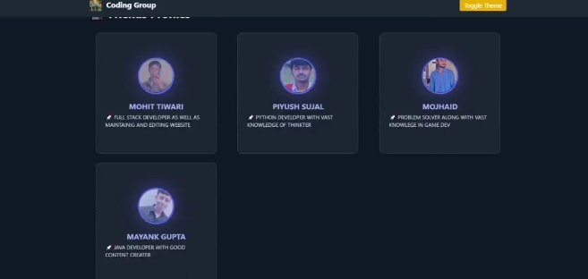
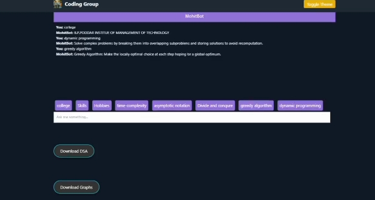

# CODING-GROUP

Welcome to the Coding Group website! This project is designed by a group of four friends to showcase our coding skills, performance metrics, and helpful resources in the areas of Data Structures and Algorithms (DSA). Additionally, it includes an interactive chatbot that assists users with DSA-related queries.A coding group is a collaborative team formed by individuals interested in coding, programming, or software development. Typically, such a group aims to work on projects, improve their coding skills, share knowledge, and assist each other in learning new technologies or programming languages.

  

Here are the main components of a typical coding group:
1. Team Members:

Roles: Each member may take on different roles based on their skills, interests, and the requirements of the project. Roles might include a project manager, front-end developer, back-end developer, and database administrator.

Diversity of Skills: Members often come with varied backgrounds and expertise, enriching the group with different perspectives and solutions.

  

2. Objectives:

Learning: One of the primary goals is to learn from each other, experimenting with new technologies and tools.

Project Development: The group might be focused on building a specific project, such as a website, application, or software tool.

Problem-Solving: Group members often collaborate to tackle coding challenges or algorithmic problems, such as those found in Data Structures and Algorithms (DSA).

3. Activities:

Meetings: Regular meetings to discuss progress, share knowledge, and brainstorm ideas.

Code Reviews: Group members may review each other's code to provide feedback and suggestions for improvement.

Workshops and Study Sessions: Organizing sessions to learn about specific programming languages, frameworks, or concepts.

4. Resources:

Documentation: Sharing resources such as tutorials, coding challenges, and articles that help in learning and practicing coding.

Tools: Utilizing version control systems (like Git), project management tools (like Trello or Jira), and communication platforms (like Slack or Discord).

## Features

- Team Showcase: A dedicated section displaying each member's name, skills, and performance metrics.
- DSA Chatbot: An interactive chatbot to provide assistance and answer questions related to Data Structures and Algorithms.
- Resource Notes: A collection of notes and references for enhancing coding skills and understanding DSA concepts.

## Tech Stack

This website has been developed using the following technologies:

- Frontend: HTML, CSS, JavaScript
- Backend: Node.js, Express (if applicable)

        ![
